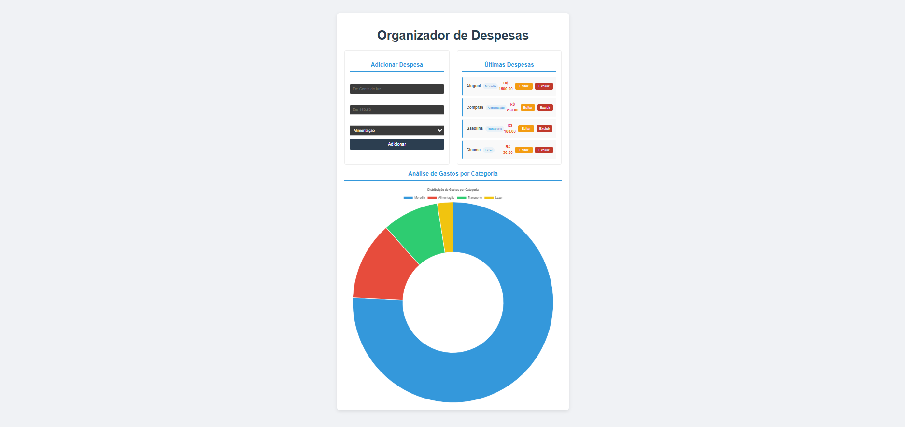

# Organizador de Despesas

Este é um aplicativo de controle financeiro que permite registrar gastos, categorizá-los e visualizar a distribuição de despesas em um gráfico. O objetivo do projeto é fornecer uma ferramenta simples e visual para que o usuário tenha um controle financeiro básico e consciente.

## Tecnologias

- **Vue.js**: Framework JavaScript progressivo para a construção de interfaces reativas e dinâmicas.
- **TypeScript**: Adiciona tipagem estática ao JavaScript, tornando o código mais robusto e fácil de manter.
- **Vite**: Ferramenta de build moderna e extremamente rápida para o ambiente de desenvolvimento.
- **Chart.js**: Biblioteca de código aberto para a criação de gráficos interativos e elegantes.

## Funcionalidades

- **Registro de Despesas**: Adicione novas despesas com descrição, valor e categoria.
- **Visualização de Dados**: O gráfico de rosca (doughnut chart) exibe a proporção dos gastos por categoria em tempo real.
- **Edição de Despesas**: Corrija a descrição, o valor ou a categoria de um gasto já registrado.
- **Exclusão de Itens**: Remova despesas da lista a qualquer momento.
- **Reatividade Total**: A lista de despesas e o gráfico são atualizados automaticamente a cada nova ação (adicionar, editar ou excluir), graças à reatividade do Vue.js.

## Como Executar o Projeto

Para rodar a aplicação localmente, siga os seguintes passos no seu terminal:

1.  Navegue até o diretório do projeto:
    ```bash
    cd organizador-de-despesas
    ```
2.  Instale as dependências necessárias:
    ```bash
    npm install
    ```
3.  Inicie o servidor de desenvolvimento:
    ```bash
    npm run dev
    ```

A aplicação estará disponível em `http://localhost:5173/`.

## Estrutura do Projeto

- **`src/App.vue`**: Contém a lógica principal (gerenciamento de estado, funções de ação), a estrutura HTML do aplicativo (formulário, lista, gráfico) e a estilização dos componentes.
- **`src/main.ts`**: Arquivo principal que cria a instância da aplicação Vue e a monta no DOM.
- **`src/style.css`**: Estilos globais para o corpo da página e outros elementos que não estão dentro de um componente específico.

## Funcionalidades Futuras

Este projeto pode ser expandido com as seguintes melhorias:

1.  **Persistência de Dados**: Utilizar `localStorage` para salvar os gastos do usuário, para que os dados não sejam perdidos ao recarregar a página.
2.  **Diferentes Tipos de Gráfico**: Adicionar opções para exibir os dados em outros formatos, como gráfico de barras ou de linha.
3.  **Filtragem de Dados**: Criar filtros para exibir gastos por período de tempo, categoria ou valor.
4.  **Componentes Separados**: Dividir o `App.vue` em componentes menores e reutilizáveis (ex: `Formulario.vue`, `ListaDespesas.vue`, `Grafico.vue`) para melhor organização do código.

---

Parabéns pelo excelente trabalho! Este projeto é um grande passo para demonstrar suas habilidades com Vue.js e visualização de dados.

# Detalhe do projeto

